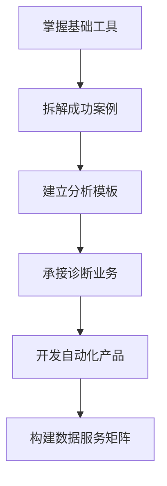

提升数据分析能力是副业创收的关键技能之一，尤其在电商、自媒体、知识付费等领域应用广泛。以下是系统化的提升路径，结合实战经验和变现思路：

**一、构建数据分析思维框架（30天）**
1. **MECE原则**：学习金字塔原理，用「相互独立，完全穷尽」方法拆解问题
2. **数据敏感度训练**：每日分析3组数据（如抖音带货转化率/公众号打开率/拼多多ROI）
3. **业务场景映射**：掌握GMV=流量×转化率×客单价等核心公式的变体应用

**二、工具技能快速突破（推荐免费工具）**
- **Excel**（1周速成）：
  - 重点掌握VLOOKUP/数据透视表/条件格式
  - 推荐「拉小登Excel」B站教程
- **Python**（2周入门）：
  - 专注Pandas库处理数据，掌握数据清洗/合并/分组聚合
  - 使用Kaggle数据集实操练习（如超市销售数据）
- **可视化工具**：
  - 新媒体从业者优先学「新榜/蝉妈妈」
  - 电商选「生意参谋/店透视」插件版（年费节省80%）

**三、实战项目操盘训练**
1. **副业诊断案例**：
   - 某知乎好物账号转化率从1.2%提升至3.5%的核心策略：
     * 通过热力图分析用户阅读轨迹
     * 用A/B测试优化商品卡位置
     * 建立关键词-转化率关联矩阵
2. **数据采集技巧**：
   - 爬虫工具：八爪鱼（免费版）+Web Scraper插件
   - 反爬策略：设置随机UA+代理IP池（低成本方案）

**四、变现场景深度应用**
1. **接单平台实操**：
   - 猪八戒网：企业报表自动化项目（客单价800-3000）
   - 淘宝代运营：店铺诊断报告（模板化操作，月入5000+）
2. **自媒体方向**：
   - 制作「小红书爆文因子分析」数据报告（信息差变现）
   - 开发「抖音直播间数据看板」SAAS工具（用DataV实现）

**五、避坑指南**
- 警惕「考证陷阱」：CDA/CPDA证书在副业市场溢价有限
- 避免「工具崇拜」：90%的副业需求用Excel+Python基础可解决
- 拒绝「报表民工」：重点培养从数据中发现增长机会的能力

**关键成长路径**：

建议从闲鱼「电商数据诊断」服务切入，单次服务定价198元，通过标准化报告模板（1小时可完成）快速积累实战经验。持续迭代3个月后，可升级为数据指导+运营优化的组合服务包，客单价提升至2000+。

